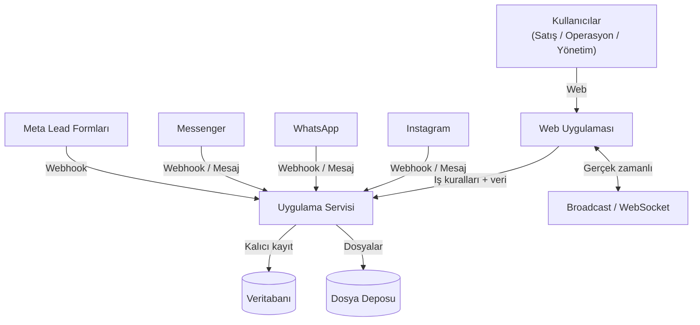
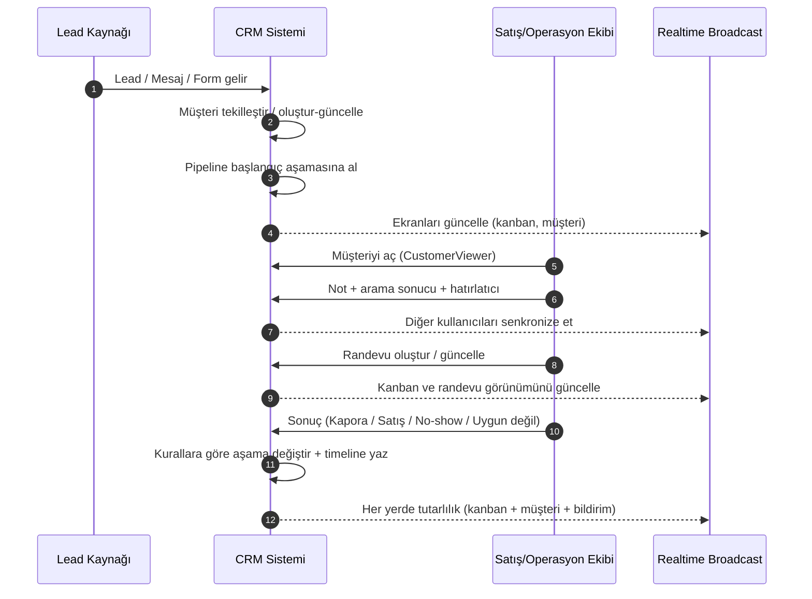
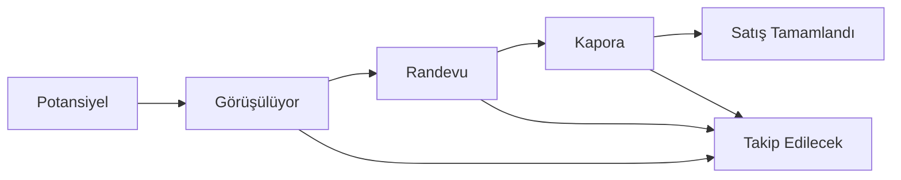
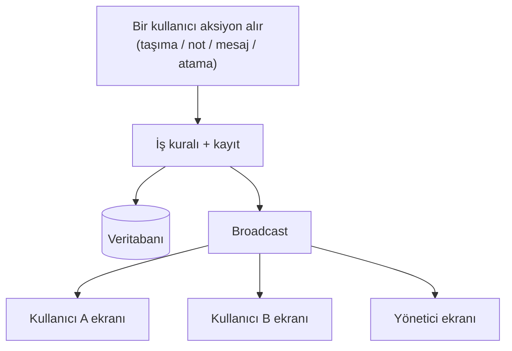
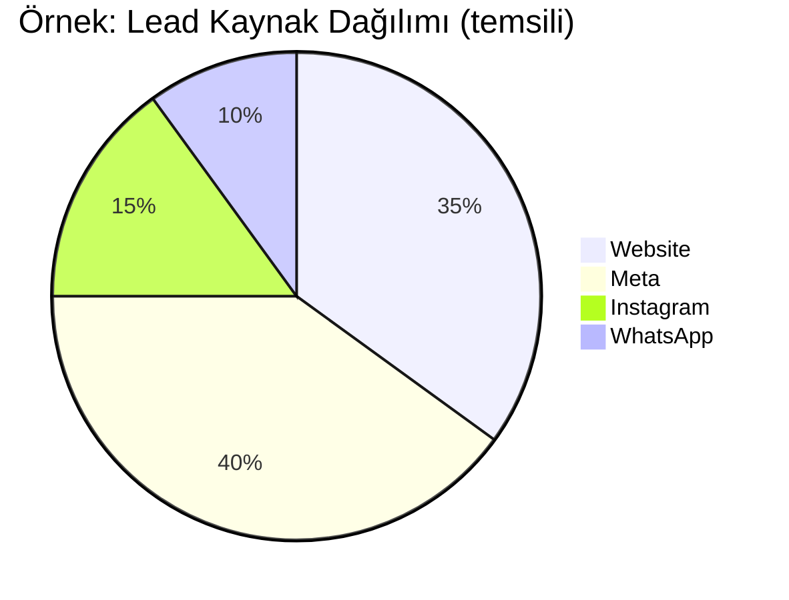

# Modern CRM (Ürün & Sistem Dokümanı)

Modern CRM; **lead ve müşteri yönetimi**, **satış süreci (pipeline) takibi**, **iş emri operasyonları**, **hatırlatıcı/not**, **raporlama** ve **çok kanallı mesajlaşma** (WhatsApp/Instagram/Messenger) yeteneklerini tek platformda birleştiren kurumsal bir sistemdir.

Bu doküman yazılımcı olmayan (İK / operasyon / yönetim) okuyucular için hazırlanmıştır: amaç **sistemin hangi parçalarının ne yaptığını**, **müşteri yaşam döngüsünü** ve **organizasyonel işleyişe etkisini** anlaşılır şekilde anlatmaktır.

> Not: Kod, dosya yolları ve geliştirme komutları burada yer almaz. Bunun yerine süreç, kavramlar ve mimari görseller (diyagramlar) vardır.

---

## İçindekiler

- [Genel Bakış](#genel-bakış)
- [Roller ve Kullanım Senaryoları](#roller-ve-kullanım-senaryoları)
- [Yüksek Seviye Mimari](#yüksek-seviye-mimari)
- [Temel Kavramlar ve Veri Yapıları](#temel-kavramlar-ve-veri-yapıları)
- [Müşteri Yaşam Döngüsü (Uçtan Uca)](#müşteri-yaşam-döngüsü-uçtan-uca)
- [Kanban / Pipeline](#kanban--pipeline)
- [Aktivite ve Timeline (Operasyon Tarihçesi)](#aktivite-ve-timeline-operasyon-tarihçesi)
- [CustomerViewer (Tek Ekran Operasyon)](#customerviewer-tek-ekran-operasyon)
- [Gerçek Zamanlı Güncellemeler (Broadcast / WebSocket)](#gerçek-zamanlı-güncellemeler-broadcast--websocket)
- [Chat & Unified Inbox](#chat--unified-inbox)
- [Meta / Instagram / WhatsApp Entegrasyonları](#meta--instagram--whatsapp-entegrasyonları)
- [Stok / Envanter Yönetimi](#stok--envanter-yönetimi)
- [Yetkilendirme ve Kullanıcı Yönetimi](#yetkilendirme-ve-kullanıcı-yönetimi)
- [Raporlama ve Analiz](#raporlama-ve-analiz)
- [Operasyon & Dayanıklılık](#operasyon--dayanıklılık)
- [Sözlük (Glossary)](#sözlük-glossary)

---

## Genel Bakış

Sistemin ana hedefleri:

- Lead’leri farklı kaynaklardan **tek havuzda** toplamak (web, reklam formları, mesaj kanalları)
- Her lead/müşterinin satış sürecindeki aşamasını **görünür ve ölçülebilir** yapmak
- Operasyon ekibinin müşteriyle ilgili işleri (not, randevu, hatırlatıcı, mesajlaşma, iş emri) **tek yerden** yürütebilmesi
- Ekip içi koordinasyonu hızlandırmak: **sorumlu atama, bildirimler, audit/tarihçe, gerçek zamanlı güncellemeler**

---

## Roller ve Kullanım Senaryoları

- **Satış Temsilcisi**: Lead’leri takip eder, pipeline’da ilerletir, randevu/geri arama planlar.
- **Çağrı / Operasyon**: No-show, tekrar arama, dokümantasyon, iş emri adımlarını yönetir.
- **Yönetici / Takım Lideri**: KPI’ları izler, kaynak performansı ve süreç verimliliğini görür.
- **Admin / Sistem Sorumlusu**: Kullanıcı/yetki yönetimi, entegrasyon ayarları, operasyonel bakım.

---

## Yüksek Seviye Mimari

Sistem; bir web uygulaması, bir uygulama servisi (API), veritabanı ve entegrasyon katmanlarından oluşur. Kullanıcılar tek arayüzden çalışır; sistem içindeki değişiklikler (kanban hareketleri, müşteri güncellemeleri, yeni mesajlar) diğer kullanıcıların ekranlarına gerçek zamanlı yansır.

---

## Temel Kavramlar ve Veri Yapıları

Bu bölüm, sistemin “neye göre çalıştığını” anlamak için kritik kavramları özetler.

### 1) Lead ve Customer (Müşteri)

- **Lead**: Sisteme ilk kez düşen potansiyel müşteri sinyali (form, mesaj, kampanya).
- **Customer**: Tekilleştirilmiş (mümkünse telefon/e-posta üzerinden) müşteri kaydı; süreç boyunca tüm aksiyonlar bu kayıt etrafında toplanır.

Tipik alanlar (kavramsal):

- Kimlik/iletişim: ad, telefon, e-posta
- Kaynak bağlamı: kampanya/kaynak bilgisi (UTM vb.)
- Operasyon bağlamı: sorumlular, kalite skoru, son temas tarihi, notlar

### 2) Kanban Card (Müşteri Kartı)

Kanban’daki her kart, bir müşteri kaydını temsil eder. Kartın amacı “süreç içinde nerede olduğumuzu” tek bakışta göstermek ve ekip içi devri kolaylaştırmaktır.

Kart üzerinde (kavramsal) görülebilen bilgiler:

- Müşteri adı/telefonu
- Bulunduğu aşama (kolon)
- Sorumlu(lar)
- Kaynak (web / sosyal kanal / kampanya)
- Son temas / geciken takip işareti
- Yaklaşan hatırlatıcı / randevu
- Okunmamış mesaj göstergesi (varsa)

### 3) Activity (Aktivite) ve Timeline

Sistem, müşteri operasyonlarını “aktivite” olarak modelleyerek izlenebilir hale getirir.

- **Aktivite**: Örn. “İlk Görüşme”, “Randevu”, “Kapora”, “Satış”, “No-show takip”, “Tekrar başvuru”.
- **Timeline (Event)**: Aktivite içindeki tekil olaylar: arama yapıldı, not eklendi, aşama değişti, randevu verildi, sonuçlandı gibi.

Bu sayede “kim, ne zaman, ne yaptı” sorusu netleşir.

### 4) CustomerViewer (Tek Ekran Operasyon)

CustomerViewer, bir müşteriyle ilgili dağınık bilgileri tek ekranda birleştiren operasyon yaklaşımıdır:

- müşteri temel bilgileri
- sorumlular/kalite/etiketler
- timeline (operasyon geçmişi)
- randevu/hatırlatıcı/notlar
- mesaj geçmişi (kanallara göre)
- satış / stok ilişkisi (varsa)

Amaç: “liste ekranı → farklı sayfalara dağılmış işlemler” yerine, tek yerden akıcı operasyon.

### 5) Work Orders (İş Emirleri)

İş emri; müşteri veya iç operasyonla ilgili süreçlerin adım adım yönetilmesini sağlar:

- iş tanımı
- sorumlu(lar)
- durum/ilerleme
- adım bazlı tamamlanma

### 6) Notifications & Reminders (Bildirim & Hatırlatıcı)

- Bildirimler: önemli olayları (yeni mesaj, atama, kritik güncelleme) hedef kişilere taşır.
- Hatırlatıcılar: “şu tarihte ara / randevu teyidi / evrak bekleniyor” gibi takip işlerini kaçırmamayı sağlar.

---

## Müşteri Yaşam Döngüsü (Uçtan Uca)

Bu akış, lead’in sisteme düşmesinden satışın tamamlanmasına kadar olan genel çerçeveyi gösterir. (Gerçek hayat senaryolarında adımlar farklı sırada olabilir.)

Tipik sonuçlar:

- **Randevu alındı** → takip ve hazırlık adımları
- **Kapora alındı** → stok/ürün ilişkisi ve satışa hazırlık
- **Satış tamamlandı** → kapanış ve raporlama
- **Müşteri gelmedi / vazgeçti** → yeniden takip veya farklı aşamaya dönüş

---

## Kanban / Pipeline

Kanban, satış sürecini aşamalara bölerek “işin nerede takıldığı”nı görünür kılar.

Kanban’ın temel davranışları:

- Kart taşıma (aşama değişimi)
- Sorumlu atama / sorumluya göre filtreleme
- Kaynak/kampanya/kalite gibi kriterlere göre filtreleme
- Toplu operasyonlar (yönetici/admin yetkisine bağlı)

Önemli prensip: Kanban hareketi sadece görsel bir hareket değildir; çoğu zaman **timeline’a kayıt**, **bildirim**, **gerçek zamanlı güncelleme** ve bazı durumlarda **entegrasyon tetikleri** doğurabilir.

---

## Aktivite ve Timeline (Operasyon Tarihçesi)

Aktivite yaklaşımı, süreci “kapanabilir iş paketleri” gibi yönetmeye yardımcı olur.

Örnek aktivite türleri (kavramsal):

- Lead girişi
- Görüşme / arama
- Randevu
- Kapora
- Satış
- No-show / yeniden takip

Timeline event örnekleri:

- Not/yorum eklendi
- Arama yapıldı
- Randevu oluşturuldu
- Aşama değişti
- Aktivite tamamlandı / sonucu girildi

Kazanımlar:

- Denetlenebilirlik: “kim, ne zaman, ne yaptı?”
- Süreç kalitesi: hangi aşamada kayıp yaşanıyor?
- Ekip devri: müşteri hikayesi kaybolmaz

---

## CustomerViewer (Tek Ekran Operasyon)

CustomerViewer, müşteri operasyonunu tek ekranda toplar:

- Müşteri kartının “detay” görünümü
- Timeline ve geçmiş
- Hızlı aksiyonlar: not, hatırlatıcı, randevu, sorumlu değişimi
- Mesaj geçmişi (kanal bazlı)
- Stok/ürün ilişkisi (varsa)

Bu ekranın en kritik özelliği: bir işlemin sonuçları yalnızca o kullanıcıda kalmaz; sistem genelinde (kanban, bildirimler, diğer kullanıcı ekranları) tutarlı hale gelir.

---

## Gerçek Zamanlı Güncellemeler (Broadcast / WebSocket)

Sistem, çok kullanıcılı çalışma düzeni için gerçek zamanlı senkronizasyon sağlar. Bir kullanıcı müşteri üzerinde işlem yaptığında, diğer kullanıcıların ekranları (özellikle kanban ve viewer) anında güncellenir.

Gerçek zamanlı sistemin prensipleri:

- **Tutarlılık**: Kanban, müşteri detay ve chat aynı gerçeği gösterir.
- **Hedefli yayın**: Her güncelleme herkes için görünmeyebilir; yetkiye/sorumluya göre sınırlandırma yapılabilir.
- **Gürültü kontrolü**: Ekranların “gereksiz refresh” yerine anlamlı güncellemelerle senkronize olması hedeflenir.

---

## Chat & Unified Inbox

Amaç: Farklı kanallardan gelen mesajları tek bir operasyon yaklaşımında yönetmek.

- **Internal chat**: Kullanıcılar arası takım içi iletişim.
- **Unified inbox**: WhatsApp/Instagram/Messenger mesajlarının tek yerde görünmesi.
- Mesajların müşteriyle ilişkilendirilmesi (mümkünse otomatik, gerektiğinde manuel).
- Okundu/okunmadı, yazıyor, çevrimiçi gibi sinyallerin gerçek zamanlı yansıması.

Operasyon faydası: müşteriyle yapılan yazışmalar kaybolmaz; başka biri devraldığında geçmişi görür.

---

## Meta / Instagram / WhatsApp Entegrasyonları

Entegrasyon katmanı iki ana ihtiyacı karşılar:

1) **Lead / mesaj girişini CRM’ye bağlamak**

- Sosyal kanallardan veya lead formlarından gelen sinyaller sisteme düşer.
- Sistem ilgili müşteriyi bulur/oluşturur ve operasyon akışına sokar (pipeline + timeline).

2) **Kampanya etkisini izlemek (attribution)**

- Kaynak/kampanya bilgisi (UTM benzeri alanlar) müşteriye bağlanır.
- Bu sayede “hangi kaynak daha iyi dönüşüyor?” sorusu raporlanabilir.

> Reklam optimizasyonu için (kurgu olarak) bazı standart olayların üçüncü taraf sistemlere iletilmesi mümkün olacak şekilde tasarlanır. Bu aktarım, tekrar denemelerde aynı olayın iki kez sayılmaması için idempotent/dedup prensibiyle ele alınır.

---

## Stok / Envanter Yönetimi

Stok/Envanter modülü (ör. proje/ürün/plot gibi varlıklar) satış sürecine bağlanabilir:

- Envanter listesi ve temel durumlar
- Müşteriyle ilişkilendirme (rezervasyon/kapora/satış gibi aşamalarda)
- Satış tamamlandığında durum güncelleme

Bu modülün amacı: satış ekibi ve operasyonun aynı “gerçek stok” üzerinden çalışmasını sağlamak ve raporlama doğruluğunu artırmaktır.

---

## Yetkilendirme ve Kullanıcı Yönetimi

Sistem güvenliği ve kurumsal düzen için iki katmanlı yaklaşım vardır:

### 1) Kimlik Doğrulama (Authentication)

- Kullanıcı girişi olmadan erişim yoktur.
- Oturum yönetimi güvenli token/cookie yaklaşımıyla sağlanır.

### 2) Yetkilendirme (Authorization)

- **Rol bazlı**: admin/yönetici/operasyon gibi roller.
- **Modül bazlı izinler**: kullanıcı hangi modülleri görür ve hangi aksiyonları yapar.
- **Sorumlu bazlı kısıt**: müşteri üzerinde işlem yapabilme, sorumlu atamasıyla sınırlandırılabilir.

### Kullanıcı yönetimi

- Kullanıcı oluşturma/devre dışı bırakma
- Rol ve izin atama
- Organizasyonel departman/ekip ayrımı (varsa)

---

## Raporlama ve Analiz

Raporlama, operasyonu “görünür” kılar:

- Kaynak performansı: hangi kanal/kampanya daha verimli?
- Süreç verimliliği: aşamalar arası dönüşüm oranları
- Operasyon yükü: randevu yoğunluğu, hatırlatıcı backlog, takım performansı

> Not: Yukarıdaki grafik temsili bir örnektir; gerçek veriler sistem raporlarından gelir.

---

## Operasyon & Dayanıklılık

Kurumsal kullanım için operasyonel konular önemlidir:

- **Yedekleme**: Veritabanı yedeklerinin düzenli alınabilmesi hedeflenir.
- **Loglama / İzlenebilirlik**: Kritik işlemler ve hatalar kayıt altına alınır.
- **Gizli bilgi yönetimi**: Entegrasyon anahtarları ve benzeri hassas bilgiler güvenli şekilde saklanmalıdır.
- **Veri güvenliği**: Kişisel veriler (telefon/e-posta vb.) erişim ve loglarda dikkatle ele alınmalıdır.

---

## Sözlük (Glossary)

- **Lead**: Potansiyel müşteri sinyali.
- **Customer**: Tekilleştirilmiş müşteri kaydı.
- **Pipeline / Kanban**: Satış sürecinin aşamalara bölünmüş görsel akışı.
- **Card (Kart)**: Kanban’da bir müşterinin temsilidir.
- **Activity (Aktivite)**: Müşteri operasyonunu yöneten iş paketi (randevu, satış vb.).
- **Timeline**: Aktivite içindeki olayların zaman çizelgesi.
- **CustomerViewer**: Müşteriyi tek ekranda operatif yönetim yaklaşımı.
- **Broadcast / WebSocket**: Ekranların gerçek zamanlı senkronize olması.
- **UTM / Attribution**: Müşterinin hangi kampanya/kaynaktan geldiğini izleme.
