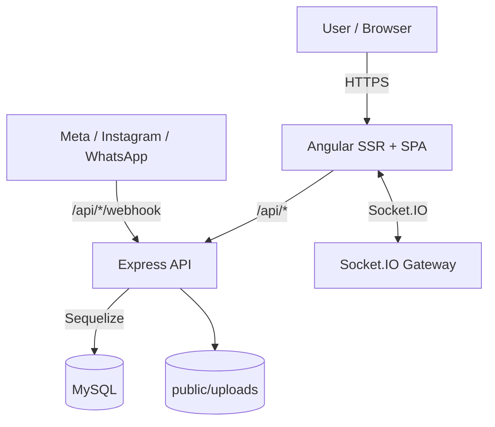

# ArvivaCRM 🚀

<p align="center">
	<b>Full‑stack CRM (Angular SSR + Express + MySQL/Sequelize + Socket.IO)</b><br/>
	<i>Kurumsal ölçekte satış/lead yönetimi, Kanban, iş emirleri, sosyal mesajlaşma ve Meta/WhatsApp/Instagram entegrasyonları</i>
</p>

<p align="center">
	
	
	
	
	
	
	
</p>

<details>
	<summary><b>✨ Hızlı İçindekiler</b></summary>

	- [Genel Bakış](#genel-bakış)
	- [Mimari](#mimari)
	- [Müşteri Yaşam Döngüsü (Lead → Kanban → CustomerViewer)](#müşteri-yaşam-döngüsü-lead--kanban--customerviewer)
	- [Core Concepts](#core-concepts)
	- [Prod-Ready Notlar](#prod-ready-notlar)
	- [Özellikler (Modül Bazlı)](#özellikler-modül-bazlı)
	- [Frontend Route Yapısı](#frontend-route-yapısı)
	- [Backend API Route Yapısı](#backend-api-route-yapısı)
	- [Meta / Instagram / WhatsApp (Webhook + Mesajlaşma)](#meta--instagram--whatsapp-webhook--mesajlaşma)
	- [Yetkilendirme Modeli](#yetkilendirme-modeli)
	- [System Config & Runtime Secret Yönetimi](#system-config--runtime-secret-yönetimi)
	- [Gerçek Zamanlı Event Sistemi (Socket.IO)](#gerçek-zamanlı-event-sistemi-socketio)
	- [Dosya & Medya Yönetimi](#dosya--medya-yönetimi)
	- [Yedekleme & Operasyon](#yedekleme--operasyon)
	- [Kurulum & Çalıştırma](#kurulum--çalıştırma)
	- [Build / SSR / Prerender](#build--ssr--prerender)
	- [Güvenlik Notları](#güvenlik-notları)
	- [Klasör Yapısı](#klasör-yapısı)

</details>

---

## Genel Bakış

ArvivaCRM; **lead ve müşteri yönetimi**, **Kanban süreçleri**, **iş emri (work order) operasyonları**, **notlar ve hatırlatıcılar**, **kampanya analitiği**, **Google Drive tabanlı dosyalama** ve **çok kanallı mesajlaşma** (WhatsApp/Instagram/Messenger) gibi modülleri tek bir platformda birleştirir.

Bu repo; hem **Angular (SSR) web uygulamasını** hem de aynı process içerisinde çalışan **Express API katmanını** barındırır.

---

## Mimari



> GitHub Mermaid render notu: Diyagramda emoji/tabs yerine sade ASCII kullanılır.

**Ana bileşenler**
- **Angular 19 SSR**: Server-side rendering + hydration
- **Express**: REST API + webhook endpoint’leri
- **Sequelize**: MySQL ORM
- **Socket.IO**: Kanban, müşteri güncellemeleri ve chat için realtime yayın
- **Runtime Config**: Prod secrets yönetimi (DB + şifreleme + env fallback)

---

## Müşteri Yaşam Döngüsü (Lead → Kanban → CustomerViewer)

Bu projede “müşteri” sadece `customers` tablosundaki bir kayıt değildir. Müşteri; **Kanban kartı (pipeline konumu)**, **aktivite/timeline (operasyon geçmişi)**, **multi-channel mesajlaşma geçmişi** ve **UTM/kampanya bağlamı** ile birlikte ele alınır.

Bu yüzden mimaride iki kritik karar var:
- **Lead ingestion** akışları (Website / Meta / Instagram / WhatsApp) müşteriyi oluşturur/günceller ve **Kanban’da Potansiyel** kolona düşürür.
- Operasyon sırasında “tek ekran” yaklaşımı için **CustomerViewer** (modal) kullanılır: müşteriyle ilgili tüm veri ve aksiyonlar tek bir agregasyon API’sinden yüklenir.

### Müşteri süreci timeline (high-level)

```mermaid
sequenceDiagram
	autonumber
	participant Src as Lead Source
	participant Api as Express API
	participant Db as MySQL (Sequelize)
	participant Kb as Kanban (Card/Column)
	participant Rt as Socket.IO
	participant Ui as Angular UI
	participant Cv as CustomerViewer

	Src->>Api: Lead arrives (website/webhook)
	Note over Src,Api: Examples: POST /api/general/projectweb\nWebhook: /api/meta/webhook, /api/instagram/webhook, /api/whatsapp/webhook

	Api->>Db: Upsert Customer (+ optional UTM/message)
	Api->>Db: Ensure KanbanCard exists
	Api->>Kb: Set columnId = 1 ("Potansiyel")
	Api->>Db: Create/ensure pending Activity\n(POTANSIYEL_MUSTERI_GIRISI / WHATSAPP_LEAD / INSTAGRAM_LEAD / MESSENGER_LEAD)
	Api-->>Rt: Broadcast customer/kanban updates

	Ui->>Kb: Sales/team works pipeline (move card)
	Ui->>Cv: Open viewer (toolbar/chat/kanban)
	Cv->>Api: GET /api/customerviewer/:customerId/details
	Api->>Db: Aggregate: customer + responsibles\nactivities + events + reminders\ncontracts + plots/deposits\nwhatsapp/instagram/messenger messages\nlatest UTM + logsCount
	Api-->>Cv: Aggregated customer payload

	Cv->>Api: Write operations (comment/reminder/update)\n+ activity events (CALL/MOVE/STATUS_CHANGE)
	Api->>Db: Persist changes; update lastContact when needed
	Api-->>Rt: Broadcast updates for UI sync
```

### Kodda birebir karşılığı (kritik örnekler)

- **Website lead → Potansiyel + Aktivite**
	- Kaynak: `src/routes/general.router.ts`
	- `POST /api/general/projectweb` akışı:
		- Telefon ile müşteri kontrolü → yoksa müşteri oluşturur (`source: Website`)
		- Kanban kartı yoksa oluşturur; varsa **Potansiyel (columnId: 1)** kolona taşır
		- Yeni müşteri için `ActivityName.POTANSIYEL_MUSTERI_GIRISI` oluşturur
		- Mevcut müşteri için “Pending aktivite var mı?” kontrol eder; yoksa `ActivityName.YENIDEN_BASVURU` oluşturabilir

- **CustomerViewer = agregasyon + operasyon API**
	- Kaynak: `src/routes/customerviewer.router.ts`
	- `GET /api/customerviewer/:customerId/details`:
		- Yetki: admin değilse, kullanıcı müşteri “responsible” listesinde olmalı
		- Agregasyon: responsibles, quality skorları, reference, applied projects, activities+events (timeline), reviews, contracts, plots+deposit, mesaj geçmişi (WhatsApp/IG/Messenger), latest UTM, reminders ve log sayısı

> Not: CustomerViewer, route bazlı “/customers/:id” sayfasını tamamlayan bir operasyon ekranıdır. Projede birçok noktadan (Toolbar hızlı arama, Chat kartı, Kanban kartı) viewer açılarak işlem akışı hızlandırılır.

---

## Core Concepts

### 1) Resolver-first veri yükleme (Angular)
Bu proje SSR uyumu ve tutarlı “ilk ekran” davranışı için **ilk yükleme verilerini route resolver’ları üzerinden** almayı hedefler.

- Kaynak: `src/app/resolvers/*` + `src/app/app.routes.ts`
- Prensip: Sayfa ilk açılırken gereken “initial state” resolver’dan gelir; kullanıcı etkileşimiyle oluşan filtre/sayfalama/yenileme akışları component içinde devam edebilir.
- Kazanımlar: SSR’da daha stabil initial render, komponent lifecycle içinde “ilk fetch yarışları”nın azalması, daha merkezi hata yakalama.

### 2) Table altyapısı (server-side filtering/sorting/pagination)
CRM’de liste ekranlarının çoğu ortak bir tablo bileşenini kullanır.

- UI: `src/app/components/table/table.component.ts`
- State/engine: `src/app/services/table.service.ts`

Öne çıkan davranışlar:
- `TableConfig.serverSideFiltering=true` ise frontend filter uygulanmaz; filtre event’i “backend’e parametre olarak” gönderilir.
- `TableConfig.serverSideSorting=true` ise frontend sort yapılmaz; `sortBy/sortDir` gibi parametrelerle backend sıralar.
- `multiselect` filtre tipi: UI çoklu seçim yapar, seçili değerleri filtre olarak taşır.

Bu yaklaşım; büyük dataset’lerde performans ve tutarlı pagination için kritik.

### 3) Multi-select & filtre parametreleri
Özellikle **Customers** gibi sayfalarda filtreler UI’da çoklu seçim (multiselect) olarak tasarlanır.

- Pattern: tabloda kolona ait `filterOptions` set edilir; Table bileşeni “seçili değerleri” bir filtre state’i olarak yönetir.
- Backend’e taşıma: sayfa component’i filtre state’ini `filter_*` query parametrelerine map ederek API çağrısı yapar.

### 4) Activity + ActivityEvent (Timeline) modeli
Aktivite sistemi; müşteri operasyonlarını “tekil bir aktivite” ve onun “event timeline’ı” üzerinden izlenebilir kılar.

- Model: `src/models/activity.model.ts`
	- `name` (örn. `RANDEVU`, `KAPORA`, `WHATSAPP_LEAD`, `INSTAGRAM_LEAD`, ...)
	- `status`: `Pending` / `Completed`
	- `result`: kontrollü set (backend validasyonu mevcut)
- Timeline Model: `src/models/activity-event.model.ts`
	- `type`: `CALL`, `COMMENT`, `MOVE`, `STATUS_CHANGE`, `DEPOSIT_TAKEN`, `META_WEBHOOK_LEAD`, ...
	- `metadata`: JSON (kanban kolonları, entegrasyon payload referansları vb. için)

API davranışı (özet):
- `POST /api/activities`: müşteri için aktivite oluşturur, gerekiyorsa kanban kartı oluşturma/taşıma akışını tetikler.
- `GET /api/activities/:customerId`: müşteri aktivitelerini ve son event’leri getirir.
- `POST /api/activities/:id/events`: timeline’a event ekler; CALL/VIDEO_CALL gibi event’lerde `lastContact` güncellemesi yapılabilir.

### 5) CustomerViewer (tek ekran operasyon yaklaşımı)
Müşteri üzerinde yapılan işlemlerin önemli bir kısmı “liste ekranı → müşteri detay route’u” yerine **CustomerViewer modal** üzerinden yürür.

- Backend agregasyon kaynağı: `GET /api/customerviewer/:customerId/details`
- Bu endpoint tek çağrıda şunları getirir: müşteri temel alanları, sorumlular, UTM bağlamı, aktiviteler+event timeline, not/hatırlatıcılar, sözleşmeler/randevu bilgileri, plot/deposit akışı ve mesaj geçmişleri.
- Sonuç: UI tarafında birden fazla endpoint’le “ilk ekranı toplama” yerine, **tek bir snapshot** ile ekran açılır; devamındaki aksiyonlar (comment/reminder/update/event) incremental olarak ilerler.

---

## Prod-Ready Notlar

### Konfigürasyon/Secrets standardı
- DB: `DB_HOST/DB_PORT/DB_NAME/DB_USER/DB_PASS`
- JWT: `JWT_SECRET`, `JWT_REFRESH_SECRET`
- Entegrasyon token’ları: tercihen **System Config (AppConfig)**, acil durumda ENV fallback.

### SSR, Cookie ve HTTPS
Cookie auth + bazı senaryolarda `SameSite=None` + `Secure` gereksinimi nedeniyle prod ortamda **HTTPS zorunlu** kabul edilmelidir.

### Log/Observability
Express tarafında request log ve hata logları mevcut; prod’da kurumsal standartlara göre:
- PII maskleme,
- log retention,
- merkezi log (ELK/Datadog vb.) entegrasyonu
önerilir.

### Reverse proxy
Prod’da reverse proxy arkasında çalışacak şekilde `trust proxy` yaklaşımı düşünülmüştür; CORS/policy ayarları prod’da daraltılmalıdır.

---

## Özellikler (Modül Bazlı)

### 🧭 Dashboard
- KPI/istatistik endpoint’leri (ör: günlük randevular, hatırlatıcılar, aktiviteler, kullanıcı logları)
- Rol/permission bazlı görünürlük

### 👥 Customers & Lead Yönetimi
- Müşteri listesi ve detay sayfası
- Telefon bazlı hızlı arama, kanban kartı ile ilişkilendirme
- Sorumlu atama / sorumlu bazlı filtreleme
- Müşteri notları, yorumları, hatırlatıcıları, aktiviteleri

### 🧩 Kanban Süreç Yönetimi
- Board/column/card modeli
- Kart taşıma (move), görüntülendi işaretleme, export, bulk move
- Realtime yayın ile board güncellemeleri

### 🗓️ Opportunities / Appointments
- Randevu listesi, hatırlatıcılarla ilişki

### 🧾 Work Orders
- İş emri listesi
- Takvim görünümü ve kanban görünümü
- Workflow tanımları ve sorumluların tamamladığı adımlar

### 💬 Chat (Internal + Social Unified Inbox)
- Kullanıcılar arası internal chat (conversation + participants + message)
- Sosyal kanalların tek bir “inbox” altında ele alınması (WhatsApp/IG/Messenger)
- Okundu/typing/online gibi realtime event’ler
- Dosya yükleme/ek (chat upload) altyapısı

### 📊 Reports / Analysis
- Dashboard analitikleri
- Plot/satış analitiği uçları
- Kampanya analitiği (Meta insights, lead bağlama vb.)

### 🗂️ Inventory (Stok / Plot)
- Plot CRUD + bulk update
- Project bazlı plot listesi

### ☁️ Arviva Drive (Google Drive Entegrasyonu)
- Drive üzerinde listeleme/yükleme/taşıma/silme gibi endpoint’ler

---

## Frontend Route Yapısı

Route’lar Angular tarafında lazy-load (loadComponent) edilir ve **AuthGuard + Permission Guard** ile korunur.

Kaynak: `src/app/app.routes.ts`

| Route | Guard | Resolver | Amaç |
|---|---|---|---|
| `/dashboard` | `AuthGuard` + `dashboardGuard` | `dashboardResolver` | Ana panel |
| `/campaign-analytics` | `AuthGuard` + `campaignsGuard` | `CampaignAnalyticsResolverService` | Kampanya analitiği |
| `/stok` | `AuthGuard` + `inventoryGuard` | `PlotResolverService` | Stok/plot |
| `/sales-analysis` | `AuthGuard` + `analysisGuard` | `PlotSalesAnalysisResolverService` | Satış analizi |
| `/kanban` | `AuthGuard` + `kanbanGuard` | `KanbanResolverService` | Kanban |
| `/reports` | `AuthGuard` + `reportsGuard` | `AnalysisResolverService` | Raporlar |
| `/customers` | `AuthGuard` + `customersGuard` | `CustomerResolverService` | Müşteriler |
| `/customers/:id` | `AuthGuard` + `customersGuard` | `CustomerDetailResolverService` | Müşteri detayı |
| `/opportunities` | `AuthGuard` + `appointmentsGuard` | `AppointmentResolverService` | Fırsatlar/Randevular |
| `/notes` | `AuthGuard` + `notesGuard` | `NotesResolverService` | Notlar |
| `/project-management` | `AuthGuard` + `projectsGuard` | `ProjectManagementResolverService` | Proje yönetimi |
| `/user-management` | `AuthGuard` + `userManagementGuard` | `UserManagementResolverService` | Kullanıcı/rol yönetimi |
| `/chat` | `AuthGuard` + `chatGuard` | `ChatResolverService` | Mesajlaşma |
| `/work-orders` | `AuthGuard` + `workOrdersGuard` | `WorkOrdersResolverService` | İş emirleri |
| `/system-config` | `AuthGuard` + `settingsGuard` | `SystemConfigResolverService` | Sistem ayarları |
| `/arviva-drive` | `AuthGuard` + `filesGuard` | `GoogleDriveResolverService` | Drive |
| `/giris-yap` | `GuestGuard` | - | Login |
| `/profile` | `AuthGuard` | `ProfileResolverService` | Profil |
| `/video-call/:roomId` | - | - | Video görüşme odası |
| `/auth/callback` | - | - | OAuth callback |
| `/error/404`, `/error/500` | - | - | Hata sayfaları |

---

## Backend API Route Yapısı

Sunucu entry: `src/server.ts`

Tüm API’ler `/api` altında mount edilir:

| Base Path | Router | Not |
|---|---|---|
| `/api` | `general.router.ts` | Website lead girişleri + temel listeler |
| `/api/user` | `user.router.ts` | Login/refresh/logout/profile/avatar |
| `/api/permissions` | `permissions.router.ts` | Permission okuma/yazma |
| `/api/customers` | `customer.router.ts` | Müşteri CRUD + ilişkiler |
| `/api/customerviewer` | `customerviewer.router.ts` | Detay ekranı yoğun uçlar |
| `/api/kanban` | `kanban.router.ts` | Board/column/card aksiyonları |
| `/api/appointments` | `appointments.router.ts` | Randevu işlemleri |
| `/api/activities` | `activities.router.ts` | Aktivite + event akışı |
| `/api/notes` | `notes.router.ts` | Notlar |
| `/api/inventory` | `inventory.router.ts` | Plot/stock |
| `/api/work-orders` | `work-orders.router.ts` | İş emirleri |
| `/api/work-order-workflows` | `work-order-workflow.router.ts` | Workflow tanımları |
| `/api/chat` | `chat.router.ts` | Chat + unified inbox |
| `/api/notifications` | `notification.router.ts` | Bildirim & hatırlatıcı uçları |
| `/api/analysis` | `analysis.router.ts` | Analiz rapor uçları |
| `/api/plot-sales-analysis` | `plot-sales-analysis.router.ts` | Plot/satış analizi |
| `/api/campaign-analytics` | `campaign-analytics.router.ts` | Meta insights vb. |
| `/api/meta` | `meta.router.ts` | Meta Leadgen + Messenger webhook |
| `/api/instagram` | `instagram.router.ts` | Instagram webhook + mesaj |
| `/api/whatsapp` | `whatsapp.router.ts` | WhatsApp webhook + mesaj |
| `/api/google-drive` | `google-drive.router.ts` | Drive işlemleri |
| `/api/system-config` | `system-config.router.ts` | Runtime config + backup + restart |

> Not: API’lerin çoğu `authenticateToken` ile korunur.

---

## Meta / Instagram / WhatsApp (Webhook + Mesajlaşma)

Webhook endpoint’leri server start sırasında loglanır:
- `.../api/meta/webhook`
- `.../api/instagram/webhook`
- `.../api/whatsapp/webhook`

Bu katman; gelen event’leri **müşteri oluşturma/güncelleme**, **Kanban kartı üretme**, **bildirim üretme**, **CAPI event gönderme** ve **realtime broadcast** akışlarına bağlar.

**Önemli tasarım kararı**
- Token/secret gibi değerler **hard-code edilmez** ✅
- Tercih edilen kaynak: **System Config (AppConfig tablosu)** → **ENV fallback**

---

## Yetkilendirme Modeli

### 🔐 Authentication (JWT)
- Token; header (`Authorization: Bearer ...`), cookie (`token`) veya query (`?token=...`) üzerinden okunabilir.
- Refresh token cookie üzerinden doğrulanır ve access token otomatik yenilenebilir.

### 🧾 Authorization (Permission Modules)
Frontend tarafında modül bazlı permission guard uygulanır:
- Kaynak: `src/app/guards/permission.guard.ts`
- Modüller: `dashboard`, `customers`, `appointments`, `campaigns`, `projects`, `work-orders`, `kanban`, `inventory`, `reports`, `analysis`, `settings`, `user-management`, `chat`, `notes`, `files`, ...

Backend tarafında permission yönetimi:
- `/api/permissions/me`
- `/api/permissions/user/:userId`
- `/api/permissions/user/:userId/bulk`

---

## System Config & Runtime Secret Yönetimi

Amaç: Prod ortamında **token/secret yönetimini** UI üzerinden güvenli şekilde yapmak ve kod deploy’u gerektirmeden güncellemek.

Kaynak: `src/utils/runtime-config.ts` + `src/routes/system-config.router.ts`

Özellikler:
- Tanımlı secret listesi (Meta/IG/WhatsApp) + maskeli görüntüleme
- DB içinde AES-256-GCM ile şifreleme (opsiyonel): `APP_CONFIG_ENCRYPTION_KEY`
- ENV fallback (bootstrapping ve acil durum)

API:
- `GET /api/system-config/definitions` (admin)
- `PUT /api/system-config/:key` (admin)
- `DELETE /api/system-config/:key` (admin)

---

## Gerçek Zamanlı Event Sistemi (Socket.IO)

Server Socket.IO üzerinde örnek event’ler:
- Room: `join-room`, `leave-room`
- Chat: `chat:join-conversation`, `chat:typing-start`, `chat:message-read` ...
- Broadcast: `customer-update`, `kanban-update`, `whatsapp:new-message` ...

Kaynaklar:
- Socket server: `src/server.ts`
- Broadcast orchestration: `src/middlewares/broadcast.ts`

---

## Dosya & Medya Yönetimi

- Statik servis: `/uploads` → `public/uploads`
- Avatar upload: `POST /api/user/profile/avatar` (multer)

Klasörler:
- `public/uploads/avatars`
- `public/uploads/chat`
- `public/uploads/workflow`

---

## Yedekleme & Operasyon

### 💾 Otomatik mysqldump
- Sunucu açılışında otomatik backup scheduler başlar (saatlik).
- Kaynak: `src/utils/mysqldump-backup.ts` + `src/server.ts`

### 🧰 Manuel Backup (Admin)
- `POST /api/system-config/backup`
- `GET /api/system-config/backup/download`

### ♻️ Restart / Rebuild (Admin)
- `POST /api/system-config/restart`
	- Lokal: `src/restart.trigger` yazıp nodemon ile rebuild tetikler
	- Prod (PM2): `pm2 stop 0 -> ng build -> pm2 start 0`

---

## Kurulum & Çalıştırma

### 1) Gereksinimler
- Node.js 18+
- MySQL 8+

### 2) ENV ayarları
`.env.example` dosyasını `.env` olarak kopyalayın ve doldurun.

### 3) Install
```bash
npm install
```

### 4) Dev (Angular dev-server)
```bash
npm run start
```

### 5) SSR Prod run
```bash
npm run build
npm run serve:ssr:arvivacrm
```

> Not: Cookie `Secure=true` kullandığı için iframe/SSO senaryolarında **HTTPS** gereklidir.

---

## Build / SSR / Prerender

- Angular build config: `angular.json`
- SSR entry: `src/server.ts`
- Server bootstrap: `src/main.server.ts`
- Prerender route listesi: `prerender-routes.txt`

---

## Güvenlik Notları

✅ Bu repoda secret değerler **kod içine gömülmemelidir**:
- DB erişimi: `DB_HOST/DB_USER/DB_PASS/DB_NAME/DB_PORT`
- JWT secret’lar: `JWT_SECRET`, `JWT_REFRESH_SECRET`
- Entegrasyon token’ları: System Config (AppConfig) veya ENV

Önerilen minimumlar:
- Reverse proxy arkasında `trust proxy` aktif (sunucuda mevcut)
- HTTPS (cookie `SameSite=None` + `Secure` gereksinimi)
- CORS politikasını prod’da daraltma (şu an geniş)

---

## Klasör Yapısı

```
src/
	app/                 # Angular UI
	routes/              # Express routers (/api/*)
	models/              # Sequelize modelleri
	middlewares/         # Auth + broadcast + vb.
	utils/               # Yedekleme, runtime config, job scheduler, helpers
public/
	uploads/             # Avatar/chat/workflow upload alanı
backups/               # mysqldump çıktıları (runtime)
```

---

## Referans / İnceleme Notu 🏢

Bu README; mimariyi ve sistem davranışını inceleme amaçlı detaylı anlatır. Üretim ortamına alınmadan önce güvenlik, logging ve CORS gibi başlıkların kurum standartlarına göre gözden geçirilmesi önerilir.
