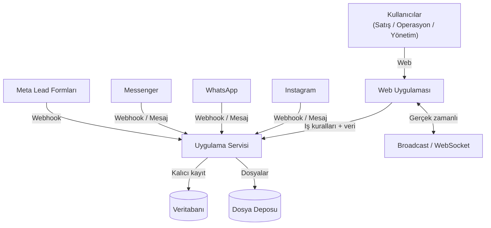
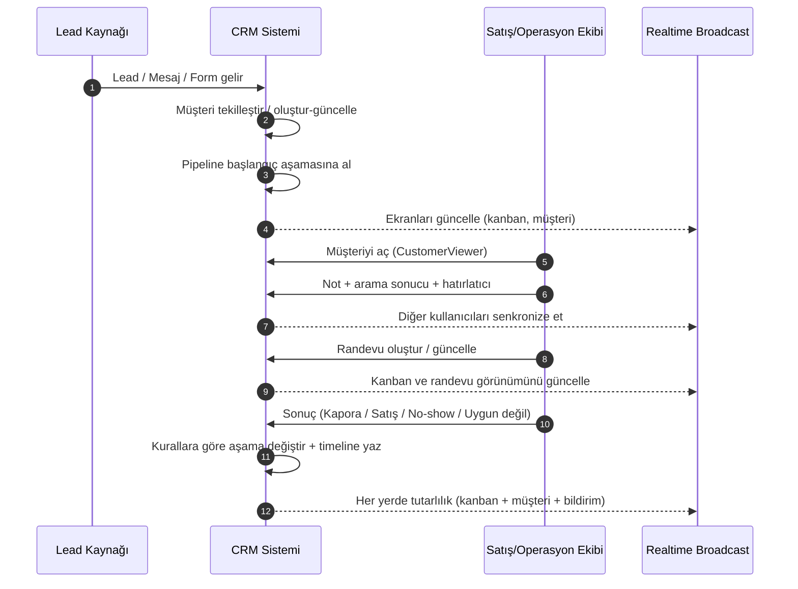
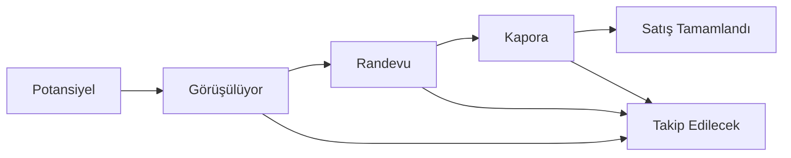
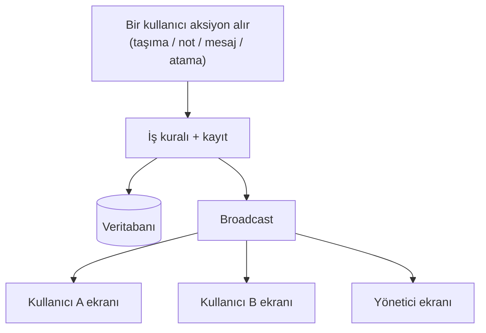
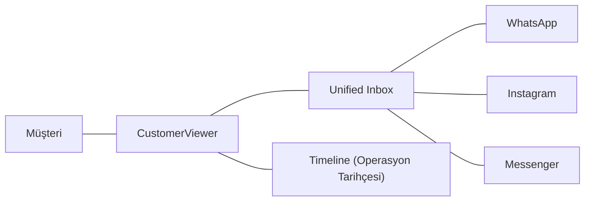
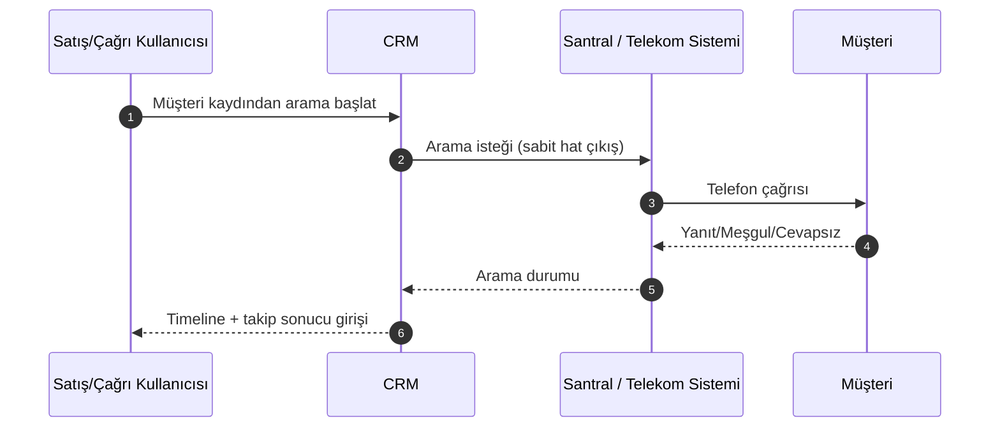
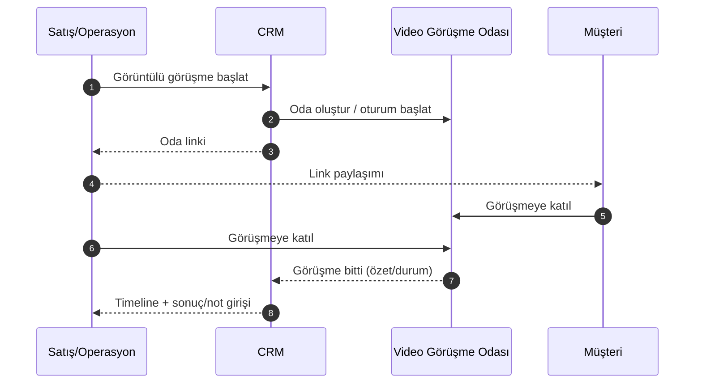
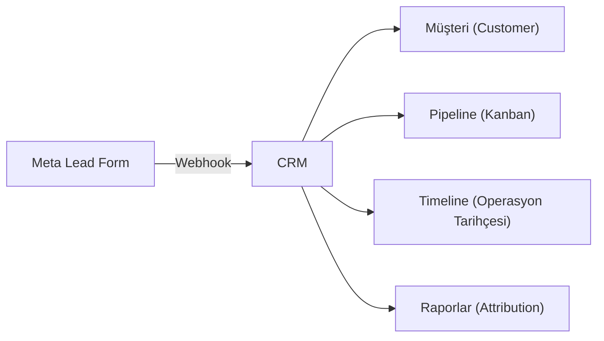
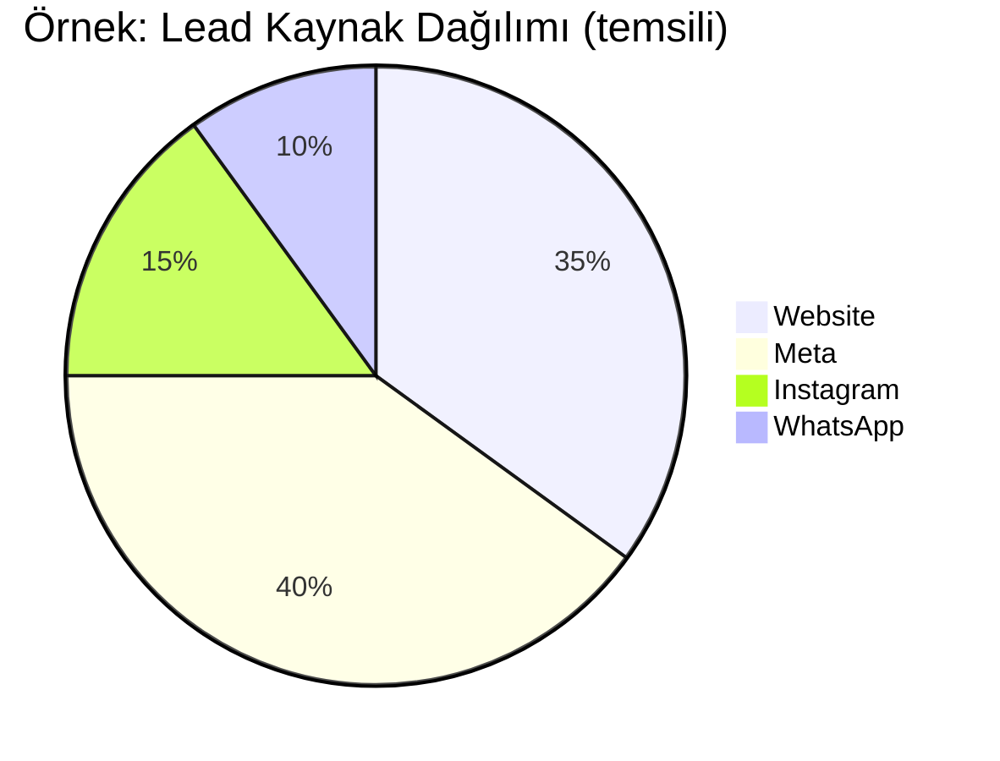

<h1 align="center">Modern CRM</h1>

	<b>Kapalı Kaynak (Proprietary)</b> 
	<i>Bu proje Arif Can Erciyas tarafından geliştirilmiştir. Kaynak kod kapalıdır ve yalnızca çok özel durumlarda, iletişim ve uygunluk değerlendirmesi sonrasında paylaşılır.</i>

	<b>Kurumsal CRM – Tek platformda satış, operasyon, mesajlaşma ve entegrasyonlar</b> 
	<i>Lead → Pipeline (Kanban) → Operasyon (CustomerViewer) → Raporlama</i>

	
	
	
	
	
	
	

 

    <h3>🚀 Canlı Demo (UI/UX Önizleme)</h3>
    <a href="https://crm.arifcan.cloud-ip.cc/" target="_blank">
        <b>https://crm.arifcan.cloud-ip.cc/</b>
    </a>
      
    <i>
		E-Posta : admin@moderncrm.local / Şifre : demo123
        ⚠️ <b>Önemli Not:</b> Bu bağlantı, yalnızca arayüz tasarımını ve genel mimariyi incelemeniz için hazırlanmış bir sandbox ortamıdır. 
        Güvenlik protokolleri gereği <b>prodüksiyon ortam değişkenleri (ENV), veritabanı bağlantıları ve API servisleri</b> bu demoda aktif edilmemiştir. 
        Bu nedenle formlar ve dinamik veri akışları işlevsiz olabilir. 
    </i>

 

Modern CRM; **lead ve müşteri yönetimi**, **satış süreci (pipeline) takibi**, **iş emri operasyonları**, **ajanda + otomatik hatırlatıcı**, **dosyalama/drive**, **raporlama** ve **tek platformda çok kanallı mesajlaşma** (WhatsApp/Instagram/Messenger + internal chat) yeteneklerini birleştiren kurumsal bir sistemdir.

Bu doküman yazılımcı olmayan (İK / operasyon / yönetim) okuyucular için hazırlanmıştır: amaç **sistemin hangi parçalarının ne yaptığını**, **müşteri yaşam döngüsünü** ve **organizasyonel işleyişe etkisini** anlaşılır şekilde anlatmaktır.

> Not: Kod, dosya yolları ve geliştirme komutları burada yer almaz. Bunun yerine süreç, kavramlar ve mimari görseller (diyagramlar) vardır.

---

## İçindekiler

- [Genel Bakış](#genel-bakış)
- [Roller ve Kullanım Senaryoları](#roller-ve-kullanım-senaryoları)
- [Yüksek Seviye Mimari](#yüksek-seviye-mimari)
- [Teknoloji Yığını (Tech Stack)](#teknoloji-yığını-tech-stack)
- [Tema (Dark / Light)](#tema-dark--light)
- [Temel Kavramlar ve Veri Yapıları](#temel-kavramlar-ve-veri-yapıları)
- [Müşteri Yaşam Döngüsü (Uçtan Uca)](#müşteri-yaşam-döngüsü-uçtan-uca)
- [Kanban / Pipeline](#kanban--pipeline)
- [Aktivite ve Timeline (Operasyon Tarihçesi)](#aktivite-ve-timeline-operasyon-tarihçesi)
- [CustomerViewer (Tek Ekran Operasyon)](#customerviewer-tek-ekran-operasyon)
- [Gerçek Zamanlı Güncellemeler (Broadcast / WebSocket)](#gerçek-zamanlı-güncellemeler-broadcast--websocket)
- [Chat & Unified Inbox](#chat--unified-inbox)
- [Santral / Telekomünikasyon (Sabit Hat Arama)](#santral--telekomünikasyon-sabit-hat-arama)
- [Görüntülü Görüşme (Meet Benzeri)](#görüntülü-görüşme-meet-benzeri)
- [Multi-select & Toplu İşlemler](#multi-select--toplu-işlemler)
- [Meta / Instagram / WhatsApp Entegrasyonları](#meta--instagram--whatsapp-entegrasyonları)
- [WhatsApp Template Pazarlama (Broadcast)](#whatsapp-template-pazarlama-broadcast)
- [Stok / Envanter Yönetimi](#stok--envanter-yönetimi)
- [Ajanda & Otomatik Hatırlatıcılar](#ajanda--otomatik-hatırlatıcılar)
- [Drive / Dosyalama Sistemi](#drive--dosyalama-sistemi)
- [Proje Yönetimi](#proje-yönetimi)
- [İş Emirleri (Work Orders) ve Workflow](#iş-emirleri-work-orders-ve-workflow)
- [Yetkilendirme ve Kullanıcı Yönetimi](#yetkilendirme-ve-kullanıcı-yönetimi)
- [Raporlama ve Analiz](#raporlama-ve-analiz)
- [Operasyon & Dayanıklılık](#operasyon--dayanıklılık)
- [Sözlük (Glossary)](#sözlük-glossary)

---

## Genel Bakış

Sistemin ana hedefleri:

- Lead’leri farklı kaynaklardan **tek havuzda** toplamak (web, reklam formları, mesaj kanalları)
- Her lead/müşterinin satış sürecindeki aşamasını **görünür ve ölçülebilir** yapmak
- Operasyon ekibinin müşteriyle ilgili işleri (not, randevu, hatırlatıcı, mesajlaşma, iş emri) **tek yerden** yürütebilmesi
- Ekip içi koordinasyonu hızlandırmak: **sorumlu atama, bildirimler, audit/tarihçe, gerçek zamanlı güncellemeler**

---

## Roller ve Kullanım Senaryoları

- **Satış Temsilcisi**: Lead’leri takip eder, pipeline’da ilerletir, randevu/geri arama planlar.
- **Çağrı / Operasyon**: No-show, tekrar arama, dokümantasyon, iş emri adımlarını yönetir.
- **Yönetici / Takım Lideri**: KPI’ları izler, kaynak performansı ve süreç verimliliğini görür.
- **Admin / Sistem Sorumlusu**: Kullanıcı/yetki yönetimi, entegrasyon ayarları, operasyonel bakım.

---

## Yüksek Seviye Mimari

Sistem; bir web uygulaması, bir uygulama servisi (API), veritabanı ve entegrasyon katmanlarından oluşur. Kullanıcılar tek arayüzden çalışır; sistem içindeki değişiklikler (kanban hareketleri, müşteri güncellemeleri, yeni mesajlar) diğer kullanıcıların ekranlarına gerçek zamanlı yansır.

---

## Teknoloji Yığını (Tech Stack)

Bu bölüm, İK ve yönetim ekipleri için “sistem hangi teknoloji sınıfında?” sorusuna kısa bir cevap verir.

- **Frontend (Web UI)**: Angular tabanlı modern web uygulaması
- **SSR (Server-Side Rendering)**: İlk ekranın daha hızlı ve stabil gelmesi için sunucu tarafı render yaklaşımı
- **Backend (Uygulama Servisi / API)**: Node.js + Express ile iş kuralları ve entegrasyon uçları
- **Veritabanı**: MySQL
- **ORM / Veri erişimi**: Sequelize
- **Gerçek zamanlı iletişim**: Socket.IO (WebSocket tabanlı)

Bu teknoloji seti; yüksek kullanıcı sayısı ve yoğun operasyon akışlarında performans/tutarlılık hedefiyle seçilmiştir.

---

## Tema (Dark / Light)

Sistem, kullanıcı deneyimini iyileştirmek için **Dark** ve **Light** tema desteğine sahiptir.

- Uzun süreli kullanımda göz yorgunluğunu azaltmaya yardımcı olur
- Farklı ekran/ortam koşullarında okunabilirliği artırır
- Kullanıcı tercihi olarak saklanabilir (kurumsal standartlara uygun şekilde)

---

## Temel Kavramlar ve Veri Yapıları

Bu bölüm, sistemin “neye göre çalıştığını” anlamak için kritik kavramları özetler.

### 1) Lead ve Customer (Müşteri)

- **Lead**: Sisteme ilk kez düşen potansiyel müşteri sinyali (form, mesaj, kampanya).
- **Customer**: Tekilleştirilmiş (mümkünse telefon/e-posta üzerinden) müşteri kaydı; süreç boyunca tüm aksiyonlar bu kayıt etrafında toplanır.

Tipik alanlar (kavramsal):

- Kimlik/iletişim: ad, telefon, e-posta
- Kaynak bağlamı: kampanya/kaynak bilgisi (UTM vb.)
- Operasyon bağlamı: sorumlular, kalite skoru, son temas tarihi, notlar

### 2) Kanban Card (Müşteri Kartı)

Kanban’daki her kart, bir müşteri kaydını temsil eder. Kartın amacı “süreç içinde nerede olduğumuzu” tek bakışta göstermek ve ekip içi devri kolaylaştırmaktır.

Kart üzerinde (kavramsal) görülebilen bilgiler:

- Müşteri adı/telefonu
- Bulunduğu aşama (kolon)
- Sorumlu(lar)
- Kaynak (web / sosyal kanal / kampanya)
- Son temas / geciken takip işareti
- Yaklaşan hatırlatıcı / randevu
- Okunmamış mesaj göstergesi (varsa)

### 3) Activity (Aktivite) ve Timeline

Sistem, müşteri operasyonlarını “aktivite” olarak modelleyerek izlenebilir hale getirir.

- **Aktivite**: Örn. “İlk Görüşme”, “Randevu”, “Kapora”, “Satış”, “No-show takip”, “Tekrar başvuru”.
- **Timeline (Event)**: Aktivite içindeki tekil olaylar: arama yapıldı, not eklendi, aşama değişti, randevu verildi, sonuçlandı gibi.

Bu sayede “kim, ne zaman, ne yaptı” sorusu netleşir.

### 4) CustomerViewer (Tek Ekran Operasyon)

CustomerViewer, bir müşteriyle ilgili dağınık bilgileri tek ekranda birleştiren operasyon yaklaşımıdır:

- müşteri temel bilgileri
- sorumlular/kalite/etiketler
- timeline (operasyon geçmişi)
- randevu/hatırlatıcı/notlar
- mesaj geçmişi (kanallara göre)
- satış / stok ilişkisi (varsa)

Amaç: “liste ekranı → farklı sayfalara dağılmış işlemler” yerine, tek yerden akıcı operasyon.

### 5) Work Orders (İş Emirleri)

İş emri; müşteri veya iç operasyonla ilgili süreçlerin adım adım yönetilmesini sağlar:

- iş tanımı
- sorumlu(lar)
- durum/ilerleme
- adım bazlı tamamlanma

### 6) Notifications & Reminders (Bildirim & Hatırlatıcı)

- Bildirimler: önemli olayları (yeni mesaj, atama, kritik güncelleme) hedef kişilere taşır.
- Hatırlatıcılar: “şu tarihte ara / randevu teyidi / evrak bekleniyor” gibi takip işlerini kaçırmamayı sağlar.

---

## Müşteri Yaşam Döngüsü (Uçtan Uca)

Bu akış, lead’in sisteme düşmesinden satışın tamamlanmasına kadar olan genel çerçeveyi gösterir. (Gerçek hayat senaryolarında adımlar farklı sırada olabilir.)

Tipik sonuçlar:

- **Randevu alındı** → takip ve hazırlık adımları
- **Kapora alındı** → stok/ürün ilişkisi ve satışa hazırlık
- **Satış tamamlandı** → kapanış ve raporlama
- **Müşteri gelmedi / vazgeçti** → yeniden takip veya farklı aşamaya dönüş

---

## Kanban / Pipeline

Kanban, satış sürecini aşamalara bölerek “işin nerede takıldığı”nı görünür kılar.

Kanban’ın temel davranışları:

- Kart taşıma (aşama değişimi)
- Sorumlu atama / sorumluya göre filtreleme
- Kaynak/kampanya/kalite gibi kriterlere göre filtreleme
- Toplu operasyonlar (yönetici/admin yetkisine bağlı)

Önemli prensip: Kanban hareketi sadece görsel bir hareket değildir; çoğu zaman **timeline’a kayıt**, **bildirim**, **gerçek zamanlı güncelleme** ve bazı durumlarda **entegrasyon tetikleri** doğurabilir.

---

## Aktivite ve Timeline (Operasyon Tarihçesi)

Aktivite yaklaşımı, süreci “kapanabilir iş paketleri” gibi yönetmeye yardımcı olur.

Örnek aktivite türleri (kavramsal):

- Lead girişi
- Görüşme / arama
- Randevu
- Kapora
- Satış
- No-show / yeniden takip

Timeline event örnekleri:

- Not/yorum eklendi
- Arama yapıldı
- Randevu oluşturuldu
- Aşama değişti
- Aktivite tamamlandı / sonucu girildi

Kazanımlar:

- Denetlenebilirlik: “kim, ne zaman, ne yaptı?”
- Süreç kalitesi: hangi aşamada kayıp yaşanıyor?
- Ekip devri: müşteri hikayesi kaybolmaz

---

## CustomerViewer (Tek Ekran Operasyon)

CustomerViewer, müşteri operasyonunu tek ekranda toplar:

- Müşteri kartının “detay” görünümü
- Timeline ve geçmiş
- Hızlı aksiyonlar: not, hatırlatıcı, randevu, sorumlu değişimi
- Mesaj geçmişi (kanal bazlı)
- Stok/ürün ilişkisi (varsa)

Bu ekranın en kritik özelliği: bir işlemin sonuçları yalnızca o kullanıcıda kalmaz; sistem genelinde (kanban, bildirimler, diğer kullanıcı ekranları) tutarlı hale gelir.

---

## Gerçek Zamanlı Güncellemeler (Broadcast / WebSocket)

Sistem, çok kullanıcılı çalışma düzeni için gerçek zamanlı senkronizasyon sağlar. Bir kullanıcı müşteri üzerinde işlem yaptığında, diğer kullanıcıların ekranları (özellikle kanban ve viewer) anında güncellenir.

Gerçek zamanlı sistemin prensipleri:

- **Tutarlılık**: Kanban, müşteri detay ve chat aynı gerçeği gösterir.
- **Hedefli yayın**: Her güncelleme herkes için görünmeyebilir; yetkiye/sorumluya göre sınırlandırma yapılabilir.
- **Gürültü kontrolü**: Ekranların “gereksiz refresh” yerine anlamlı güncellemelerle senkronize olması hedeflenir.

---

## Chat & Unified Inbox

Amaç: Farklı kanallardan gelen mesajları **tek ekranda** yönetmek ve müşteriyi satış/operasyon sürecine bağlamak.

Kapsam (tek platform yaklaşımı):

- **Internal chat (takım içi)**: Kullanıcılar arası sohbet, ekip içi koordinasyon.
- **Unified Inbox (sosyal kanallar)**: WhatsApp/Instagram/Messenger mesajlarının tek yerde görünmesi.
- **Müşteri eşleştirme**: Gelen mesajlar mümkünse otomatik olarak ilgili müşteriye bağlanır; gerekirse manuel bağlama yapılabilir.
- **Dosya/medya**: Mesaj ekleri ve görseller operasyonel geçmişin parçası olarak saklanabilir.
- **Realtime deneyim**: okundu/okunmadı, yazıyor, online gibi sinyallerin anlık yansıması.

Operasyon faydası:

- Müşteriyle yazışmalar kaybolmaz; devralma (handover) kolaylaşır.
- Aynı müşteri için farklı kanallardan gelen iletişim tek yerde birleşir.
- Mesajlaşma ile pipeline/aktivite akışı kopmaz.

---

## Santral / Telekomünikasyon (Sabit Hat Arama)

CRM içinde entegre bir **santral/telekomünikasyon** akışı bulunur. Bu sayede ekip, müşteri aramalarını uygulama içinden yönetebilir ve **sabit hat üzerinden çıkış** yapabilir.

Bu entegrasyonun amacı:

- Satış/çağrı ekiplerinin farklı uygulamalar arasında geçiş yapmadan arama yapabilmesi
- Görüşmelerin müşteri kaydıyla ilişkilendirilmesi (tarihçe/takip kalitesi)
- Operasyon yönetiminin “arama aktivitesi”ni görünür kılması

Örnek kullanım akışı:

- Müşteri kartından **tek tıkla ara**
- Arama başladığında müşteri ekranı (CustomerViewer) üzerinden not/sonuç girişi
- Arama sonucu, ilgili **aktivite/timeline** üzerine kayıt olarak düşer

> Not (uyumluluk): Arama kayıtları ve görüşme içerikleri; KVKK/izin/kurum politikalarına göre ele alınmalıdır (gerekirse maskeleme, saklama süresi, erişim yetkisi).

---

## Görüntülü Görüşme (Meet Benzeri)

Sistem içinde, “Meet benzeri” **online görüntülü görüşme** akışı bulunur. Bu özellik; satış/operasyon ekibinin müşteriyle görüntülü görüşmeyi CRM’den başlatıp yönetmesini ve görüşmeyi müşteri kaydıyla ilişkilendirmesini hedefler.

Kazanımlar:

- Görüşme linki/oda bilgisi dağınık kalmaz; müşteri kaydına bağlı olur
- Görüşme sonrası not ve sonuçlar CustomerViewer üzerinden kolayca işlenir
- Takip kalitesi artar: görüşme aktivitesi timeline’da görünür

Örnek kullanım akışı:

- CustomerViewer üzerinden **görüntülü görüşme başlat** / oda oluştur
- Link, müşteriyle paylaşılır (kurumsal süreçlere uygun şekilde)
- Görüşme bittikten sonra not/sonuç girilir ve süreç (aktivite/kanban) ilerletilir

> Not (uyumluluk): Görüşme içeriği/katılımcı verileri ve olası kayıt (recording) politikaları KVKK ve kurum standartlarına göre yönetilmelidir.

---

## Multi-select & Toplu İşlemler

Kurumsal CRM’de hız kritik olduğu için, listelerde ve kanban üzerinde “çoklu seçim” ve toplu aksiyonlar desteklenir.

Örnekler:

- **Multi-select filtreler**: Kaynaklar, sorumlular, kampanya/kategori gibi alanlarda çoklu seçimle filtreleme
- **Toplu kanban işlemleri**: Birden fazla kartı seçip hedef aşamaya taşıma (yetkiye bağlı)
- **Toplu müşteri işlemleri**: Liste üzerinde seçerek atama/etiketleme gibi yönetimsel aksiyonlar (yetkiye bağlı)

Bu yapı, özellikle yoğun inbound dönemlerinde operasyon hızını artırır.

---

## Meta / Instagram / WhatsApp Entegrasyonları

Entegrasyon katmanı iki ana ihtiyacı karşılar:

1) **Lead / mesaj girişini CRM’ye bağlamak**

- Sosyal kanallardan veya lead formlarından gelen sinyaller sisteme düşer.
- Sistem ilgili müşteriyi bulur/oluşturur ve operasyon akışına sokar (pipeline + timeline).

2) **Kampanya etkisini izlemek (attribution)**

- Kaynak/kampanya bilgisi (UTM benzeri alanlar) müşteriye bağlanır.
- Bu sayede “hangi kaynak daha iyi dönüşüyor?” sorusu raporlanabilir.

> Reklam optimizasyonu için (kurgu olarak) bazı standart olayların üçüncü taraf sistemlere iletilmesi mümkün olacak şekilde tasarlanır. Bu aktarım, tekrar denemelerde aynı olayın iki kez sayılmaması için idempotent/dedup prensibiyle ele alınır.

### Meta ile tam entegrasyon (Webhook + Reklam bağlamı)

Meta entegrasyonu yalnızca “lead gelsin” düzeyinde değildir; lead’in geldiği reklam bağlamını operasyon ve raporlamaya taşımayı hedefler.

- **Webhook ile lead toplama**: Meta Lead Form’larından gelen başvurular sisteme düşer, müşteriyle eşleştirilir ve pipeline’a alınır.
- **Reklam bağlamı (attribution)**: UTM/kampanya bilgileri müşteri kaydına bağlanır; böylece müşteri yolculuğu “hangi kampanyadan geldi?” sorusuyla birlikte izlenir.
- **Operasyon tetikleri**: Lead geldiğinde ilgili ekip/sorumlular bilgilendirilebilir ve ilk takip aksiyonları (aktivite/hatırlatıcı) başlatılabilir.

### Reklam raporları (Kampanya / Reklam Seti / Reklam)

Kampanya analitiği ve reklam raporları; pazarlama tarafının “harcama → lead → randevu → satış” zincirini takip edebilmesini hedefler.

- **Kampanya raporları**: Kampanya bazında performans (lead sayısı, dönüşüm, maliyet vb.).
- **Reklam seti raporları**: Hedefleme kırılımlarını görmeye yardımcı olur.
- **Reklam raporları**: Hangi kreatif/ilan daha iyi sonuç veriyor sorusuna destek olur.

> Not: Rapor metrikleri işletmenin karar ihtiyacına göre özetlenebilir; ana amaç, operasyon verisi (CRM) ile reklam verisini aynı hikayede buluşturmaktır.

### UTM bazlı müşteri raporları

UTM yaklaşımı, sadece pazarlama raporu değil; operasyonel verimlilik için de kullanılır:

- UTM bazında müşteri listeleri (ör. belirli kampanyadan gelenler)
- UTM bazında süreç performansı (hangi kampanya daha çok randevu/satış üretiyor?)
- UTM bazında takip kalitesi (geciken takip, no-show oranı gibi operasyon metrikleri)

### Duygusal ve mantıksal analiz (özet)

Sistem, müşteri değerlendirmesi ve önceliklendirme için “skor/kalite” yaklaşımını destekler. İşletme ihtiyacına göre iki boyutlu bir değerlendirme yapılabilir:

- **Duygusal (niyet/ilgi) analizi**: müşterinin ilgi düzeyi ve yakınlık sinyalleri
- **Mantıksal (uygunluk) analizi**: bütçe/uygunluk/gerçekleşebilirlik gibi kriterler

Bu skorlar; satış ekibinin önceliklendirmesine ve kampanya performansının daha doğru yorumlanmasına yardımcı olur.

---

## WhatsApp Template Pazarlama (Broadcast)

WhatsApp tarafında “template” (şablon) mesajlar; özellikle pazarlama veya operasyon bilgilendirmesi için kullanılır. Sistem, şablon temelli mesajlaşmayı CRM bağlamına oturtur:

- **Template katalog yönetimi**: Onaylı şablonların seçilmesi ve parametrelerle doldurulması
- **Toplu gönderim (broadcast)**: Hedef müşteri setine template mesajı gönderebilme
- **Hedefleme**: Kaynak/etiket/süreç aşaması/sorumlu gibi filtrelerle kitle seçimi
- **İzlenebilirlik**: Gönderim denemeleri, durumlar ve sonuçların operasyonel takibi

Önemli not (operasyon/gizlilik): Toplu mesajlaşma süreçleri, şirketin KVKK/izin politikalarına ve ilgili kanal kurallarına uygun tasarlanmalıdır.

---

## Stok / Envanter Yönetimi

Stok/Envanter modülü (ör. proje/ürün/plot gibi varlıklar) satış sürecine bağlanabilir:

- Envanter listesi ve temel durumlar
- Müşteriyle ilişkilendirme (rezervasyon/kapora/satış gibi aşamalarda)
- Satış tamamlandığında durum güncelleme

Bu modülün amacı: satış ekibi ve operasyonun aynı “gerçek stok” üzerinden çalışmasını sağlamak ve raporlama doğruluğunu artırmaktır.

---

## Ajanda & Otomatik Hatırlatıcılar

Ajanda ve hatırlatıcı sistemi, satış ve operasyon ekibinin “takip işleri”ni kaçırmamasını hedefler.

- **Ajanda**: Gün/hafta bazlı planlama; randevular ve takip işleri
- **Hatırlatıcılar**: “Şu tarihte ara”, “randevu teyidi”, “evrak bekleniyor” gibi görevler
- **Otomatik üretim (kural bazlı)**: Bazı sonuçlarda sistem, takip hatırlatıcısını otomatik oluşturabilir (ör. randevu alındı → teyit hatırlatıcısı)
- **Geciken takip görünürlüğü**: Süresi geçen işler “overdue” olarak görünür ve raporlanabilir

Bu yaklaşım, bireysel ajandaların dağınıklığını azaltır; takım halinde operasyonu standardize eder.

---

## Drive / Dosyalama Sistemi

CRM içindeki drive/dosyalama yaklaşımı, müşteri ve iş emri süreçlerinde evrak/medya yönetimini tek yere toplar.

- **Merkezi dosyalama**: Müşteriyle ilişkili belgeler tek yerde
- **Yetki ile uyumlu görünürlük**: Dosyalara erişim, kullanıcı rol/yetkilerine göre sınırlandırılabilir
- **Operasyon akışına bağlama**: Dosyalar müşteri kaydı veya iş emriyle ilişkilendirilebilir
- **Pratik kullanım**: Sözleşme, teklif, görseller, formlar, sahadan gelen dokümanlar

Amaç: “dosyalar kimdeydi?” problemini ortadan kaldırmak ve müşteri geçmişini tam tutmaktır.

---

## Proje Yönetimi

Proje Yönetimi alanı, satış ve operasyonun çalıştığı “proje” bazlı organizasyonu destekler.

- Proje listesi ve temel proje bilgileri
- Proje ile ilişkili envanter/stok görünürlüğü (varsa)
- Müşteri akışını proje bağlamında takip edebilme (kampanya/lead kalitesi/proje talebi gibi)

Amaç: özellikle birden fazla proje/ürün hattı olan organizasyonlarda raporlama ve operasyonu proje bazında yönetilebilir hale getirmektir.

---

## İş Emirleri (Work Orders) ve Workflow

İş emirleri, satış sonrası veya iç operasyon işlerini (adım adım) yönetmek için kullanılır.

- **İş emri listesi**: açık/kapalı işler
- **Workflow (adımlar)**: her işin takip edilebilir aşamaları
- **Sorumlular**: işin kimde olduğu ve hangi adımın kim tarafından tamamlandığı
- **Takvim/kanban görünümü**: iş yükünü görselleştirme ve planlama

Kazanım: Operasyonlar kişiye bağlı kalmaz; süreç standardı oluşur ve yönetim görünürlüğü artar.

---

## Yetkilendirme ve Kullanıcı Yönetimi

Sistem güvenliği ve kurumsal düzen için iki katmanlı yaklaşım vardır:

### 1) Kimlik Doğrulama (Authentication)

- Kullanıcı girişi olmadan erişim yoktur.
- Oturum yönetimi güvenli token/cookie yaklaşımıyla sağlanır.

### 2) Yetkilendirme (Authorization)

- **Rol bazlı**: admin/yönetici/operasyon gibi roller.
- **Modül bazlı izinler**: kullanıcı hangi modülleri görür ve hangi aksiyonları yapar.
- **Sorumlu bazlı kısıt**: müşteri üzerinde işlem yapabilme, sorumlu atamasıyla sınırlandırılabilir.

### Kullanıcı yönetimi

- Kullanıcı oluşturma/devre dışı bırakma
- Kullanıcı için **tasfiye et** (offboarding) alanı: işten ayrılma/ilişik kesme durumlarında kullanıcıyı operasyonel olarak pasifleştirme ve erişimi kapatma
- Rol ve izin atama
- Organizasyonel departman/ekip ayrımı (varsa)

---

## Raporlama ve Analiz

Raporlama, operasyonu “görünür” kılar:

- Kaynak performansı: hangi kanal/kampanya daha verimli?
- Süreç verimliliği: aşamalar arası dönüşüm oranları
- Operasyon yükü: randevu yoğunluğu, hatırlatıcı backlog, takım performansı
- Kalite skorları: duygusal/mantıksal değerlendirmeye göre önceliklendirme ve performans okuma

> Not: Yukarıdaki grafik temsili bir örnektir; gerçek veriler sistem raporlarından gelir.

---

## Operasyon & Dayanıklılık

Kurumsal kullanım için operasyonel konular önemlidir:

- **Yedekleme**: Veritabanı yedeklerinin düzenli alınabilmesi hedeflenir.
- **Loglama / İzlenebilirlik**: Kritik işlemler ve hatalar kayıt altına alınır.
- **Gizli bilgi yönetimi**: Entegrasyon anahtarları ve benzeri hassas bilgiler güvenli şekilde saklanmalıdır.
- **Veri güvenliği**: Kişisel veriler (telefon/e-posta vb.) erişim ve loglarda dikkatle ele alınmalıdır.

---

## Sözlük (Glossary)

- **Lead**: Potansiyel müşteri sinyali.
- **Customer**: Tekilleştirilmiş müşteri kaydı.
- **Pipeline / Kanban**: Satış sürecinin aşamalara bölünmüş görsel akışı.
- **Card (Kart)**: Kanban’da bir müşterinin temsilidir.
- **Activity (Aktivite)**: Müşteri operasyonunu yöneten iş paketi (randevu, satış vb.).
- **Timeline**: Aktivite içindeki olayların zaman çizelgesi.
- **CustomerViewer**: Müşteriyi tek ekranda operatif yönetim yaklaşımı.
- **Broadcast / WebSocket**: Ekranların gerçek zamanlı senkronize olması.
- **UTM / Attribution**: Müşterinin hangi kampanya/kaynaktan geldiğini izleme.
